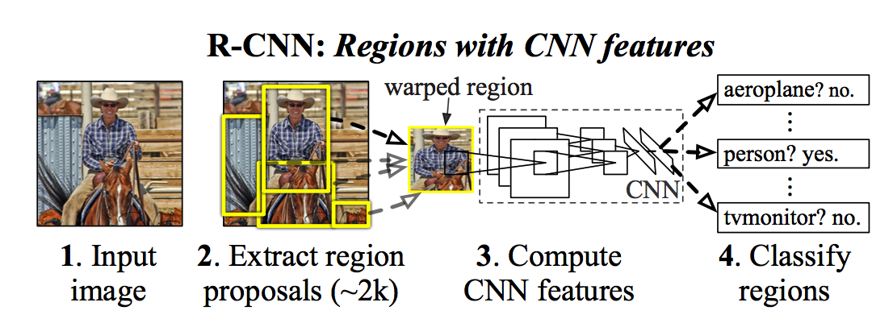

# Rich feature hierarchies for accurate object detection and semantic segmentation

2014 CVPR, Ross Girshick, Jeff Donahue, Trevor Darrell, Jitendra Malik

**R-CNN: Regions with CNN features**

### Flowchart

### Algorithm

1. **Region proposals**: selective search

2. **Feature extraciton**: warp images --> CNN extract
CNN: pre-train on imageNet and then domain-specifc fine-tuning

3. **Object category classifiers** (SVM)

4. **Bounding box regression** to improve final results

