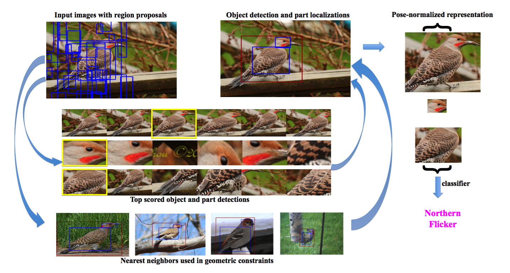

# Part-based R-CNNs for Fine-grained Category Detection

2014 ECCV, Ning Zhang, Jeff Donahue, Ross Girshick, Trevor Darrell.

### Flowchart

### Algorithm

**Semantic part localization can facilitate fine-grained categorization**

1. part-based RCNN: 

	* use RCNN to treat objects and parts as independent object categories
	* train a one-versus-all linear SVM on feature descriptors extracted over region proposals

2. Geometric constraints: 

	* consider the locations of object of parts to choose best ones

3. Fine-grained categrization: 

	* Use fine-tuned CNN model to extract feature for object and parts independently
	* one-versus-all linear SVM to classify