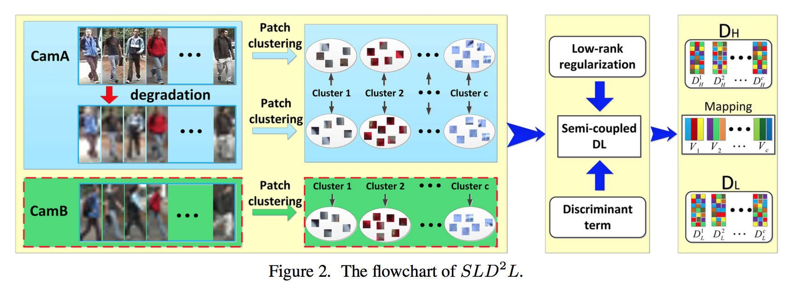

# Super-resolution Person Re-identification with Semi-coupled Low-rank Discriminant Dictionary Learning

2015 CVPR, Xiao-Yuan Jing, Xiao-Yuan Jing, Xiaoke Zhu, Fei Wu, Xinge You, Qinglong Liu, Dong Yue, Ruimin Hu, Baowen Xu

### SR Person re-identification

**Contribution:**

* Super-resolution person re-identification
* discriminant term for semi-coupled dictionary learning
* add low-rank regularization

#### Algorithm

**Mainly based on:**

* Semi-Supervised Coupled Dictionary Learning (SSCDL) for Person Re-identification
	using a mapping for HR and LR patches 

* Semi-Coupled Dictionary Learning (SCDL)
	design for SR persion re-identification instead of SR

**different terms** in dictionary learning objective function:

* mapping: mapping between cofficients
* represent: sub-dictionary representation capability term to make each sub-dictionary have poor representation abili- ty for other clusters
* lowrank: low-rank regularization term to ensure the learned HR and LR sub-dictionaries being lowrank
* **discriminant**: reconstructed features have good discriminability

Dictionary --> recontruction HR feature --> nearest neighbor classifier

#### Experiments:

**Manually** down-sample and smooth on re-identification dataset
