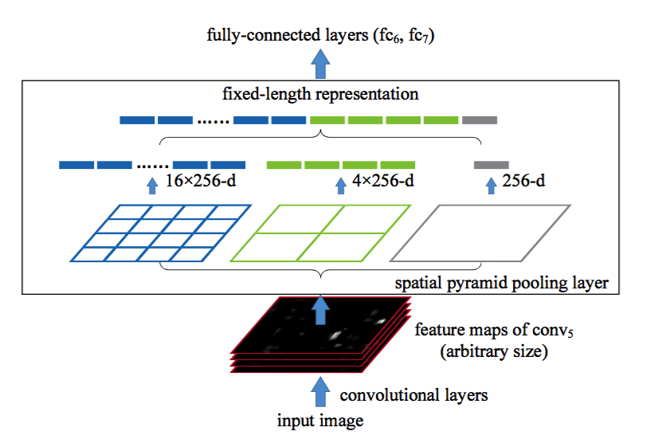

# Spatial Pyramid Pooling in Deep Convolutional Networks for Visual Recognition

2015 PAMI, Kaiming He, Xiangyu Zhang, Shaoqing Ren, and Jian Sun

**SPP-net**: can generate a fixed-length representation regardless of image size/scale

### Algorithm

* The spatial Pyramid Pooling layer

* Multi-size training

Two network with two sizes, train iteratedly by keeping all weights.
At the testing stage, it is straightfor- ward to apply SPP-net on images of any sizes.

* Image classification

* Object Detection

	* Much faster than R-CNN, since we extract the feature maps from the entire image only once (possibly at multiple scales)
	* Run multiple scales to generate feature maps of conv5 for each scale
	* for each window, choose one scale closest to 224, then extact feature maps of this window
	* Since our features are pooled from the conv5 feature maps from windows of any sizes, for simplicity we only fine-tune the fully-connected layers